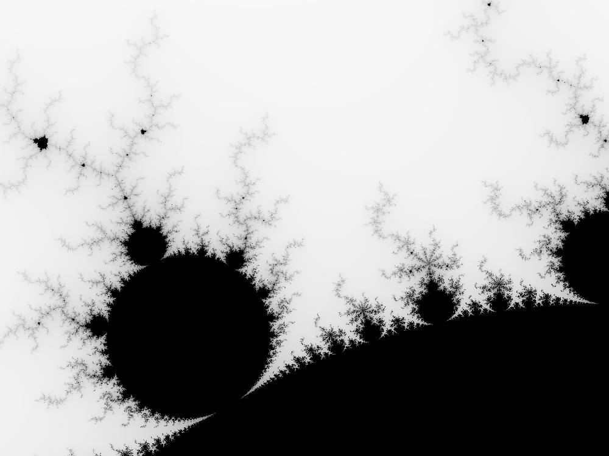

# fractals
Simple mandelbrot set visualization using OpenGL

To compile and run,
1. Install rust: https://www.rust-lang.org/tools/install
1. Execute `cargo run --release --example mandel-viz`

Controls:
* `Esc` quits
* Mouse selection zooms
* `R` resets to original view

